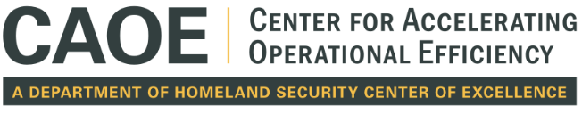

---
# A Demo section created with the Blank widget.
# Any elements can be added in the body: https://wowchemy.com/docs/writing-markdown-latex/
# Add more sections by duplicating this file and customizing to your requirements.

widget: blank  # See https://wowchemy.com/docs/page-builder/
headless: true  # This file represents a page section.
weight: 10  # Order that this section will appear.

title: Workshop on Potentials and Risks of GenAI on National Security
subtitle:  "TBD @ [DHS 2025](https://www.google.com/)"
design:
  # Choose how many columns the section has. Valid values: 1 or 2.
  columns: "1"
---

Generative AI technologies hold great promise for transforming industries and enhancing national security capabilities, but they also present significant risks, including the potential for misuse, bias, and disinformation. These technologies have been the focus of research and development for years, yet their deployment in operational contexts has been cautious due to the complex challenges they pose. This workshop aims to accelerate progress by bringing together researchers, policymakers, and practitioners to address the "hard problems" at the intersection of generative AI and national security. By fostering collaboration, we seek to develop practical solutions that enable the responsible adoption of generative AI technologies while mitigating risks and safeguarding critical systems.

This workshop will feature:
- **Specific GenAI Risks**, as presented by principals in the Homeland Security Enterprise (including program managers at the Department of Homeland Security and officials in state, local and tribal security agencies).
- **Researchers** who have been working on GenAI risks, including mitigating hallucination, defense against jailbreak attack, copyright protection, bias, privacy, and other trustworthiness issues.
- Discussions of **funding opportunities** for transitioning research to pilot programs and operational capacities within the Homeland Security Enterprise.

This workshop will combine presentations and discussions, with a heavy emphasis on finding specific approaches (and new approaches) that solve specific problems within the next three to five years.

**This event is hosted by the Center for Accelerating Operational Efficiency, a Department of Homeland Security Center of Excellence led by Arizona State University, in collaboration with the Department of Homeland Security Privacy Office.**

**Conference Chairs:**
- [Kai Shu](https://www.cs.emory.edu/~kshu5/), Emory University
- [Huan Liu](https://www.public.asu.edu/~huanliu/), Arizona State University
- TBD, Department of Homeland Security

