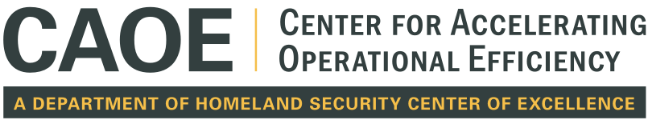

### Problem Statement Submission

**We are soliciting 2-page white papers from researchers that describe generative AI solutions that are ready or nearly ready to deploy, or that have demonstrated success in other application areas.** We are particularly interested in white papers addressing generative AI techniques that enable:
- **Secure and ethical generation and analysis of synthetic data** to support training and operational scenarios while preserving privacy and mitigating bias.
- **Responsible and explainable AI-driven intelligence analysis**, such as summarization, translation, or threat detection across diverse data sources, including text, imagery, and multimedia.
- **AI-assisted counter-disinformation strategies** that identify, analyze, and neutralize disinformation campaigns while safeguarding democratic values.
- **Privacy-preserving natural language processing and generation** to enhance operational capabilities without compromising sensitive data.
- **Techniques for secure and transparent collaboration** among multiple stakeholders, such as federated learning or decentralized AI models, to analyze shared datasets without exposing proprietary or sensitive information.
- **Innovative AI applications for operational needs** currently hindered by risks of misuse, ethical concerns, or barriers to data access and sharing.

The program committee will evaluate submissions based on their quality, relevance, potential to stimulate meaningful discussion, and capacity to contribute to an impactful workshop report. Preference will be given to unique, well-articulated positions that highlight potentially transformative research directions in generative AI for operational and national security applications.

**We have problems that need to be solved today, and are looking for engaged researchers who want to help.**
While this workshop is focused on novel solutions to today’s problems, we are also eager to hear from researchers who have innovative ideas that they feel would benefit from special attention now, even if there are no specific pragmatic uses in the near-term. This event is not about theory, it’s about practice. However, some ideas are so novel or important that they require attention now, before there is a problem. Researchers are encouraged to submit ideas that would benefit from discussion with Homeland Security stakeholders: please flag your idea as a discussion topic and it will be reviewed as such. Please indicate if you would like to have the idea included in the conference materials if it is not selected for discussion.

Topics that are out-of-scope for the workshop include research agendas with more than a five-year horizon, quantum information science and blockchain technology.

Submissions will be evaluated based on the near-to-long term pragmatic and pressing nature of the problem described and the and simple-to-complex solutions proposed to solve those problems. Priority will be given to solving near-term pragmatic problems using simple solutions. These will be labeled “quick wins”. Second place priority will be given to problems that can only be solved by complex solutions that require protracted focus and perseverance. These will be labeled “hard problems.” The conference will be designed based on the nature of the submissions received. We encourage individuals and groups to submit multiple white papers so we can arrange a useful conference that offers solutions in both categories.
Selected contributors will have the opportunity to participate in the workshop currently planned as an in-person event June 21st, 2022, or to submit pre-recorded video presentations

**Paper Length and Format:** Up to 2 pages (references included), at least 11-point font PDF file. Note: papers will be distributed in print at the workshop and published on the workshop website; PDFs may include links to other resources on the Internet.

Workshop products will include a publicly available written report that includes the problem statements, white papers, and a summary of the workshop discussions and a video archive of selected presentations.

**Workshop products** will include a publicly available written report that includes the problem statements, white papers, and a summary of the workshop discussions and a video archive of select presentations.

#### Submission
**To submit for this workshop, please visit: [https://easychair.org/conferences/?conf=TBD](https://easychair.org/conferences/?conf=TBD)**

- **Due Date:** 1:59 PM AOE on May 1, 2025
- **Notification of Selection**: May 20, 2025
- **Workshop Date:** June 21, 2025
- **Location:** 1800 I St NW, Washington, DC 20006 

**Note:** A limited amount of funding is available to cover the travel expenses of workshop participants attending from accredited public and private institutions of higher education in the United States and non-profit research institutions.

**This event is hosted by the Center for Accelerating Operational Efficiency, a Department of Homeland Security Center of Excellence in collaboration with the Department of Homeland Security Privacy Office.**

_This material is supported by the U.S. Department of Homeland Security under Grant Award Number, 17STQAC00001-05-03._

**Disclaimer.** The views and conclusions contained in this document should not be interpreted as representing the official policies, either expressed or implied, of the U.S. Department of Homeland Security.

